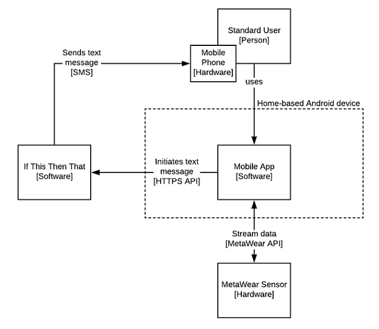
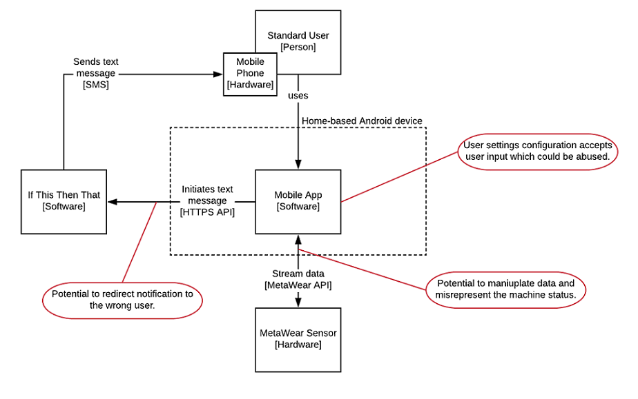

# Laundry Notification App

## Executive Summary
Are you so busy that you forget to switch your laundry around?  Do you find yourself having to re-wash clean laundry because it has sat in the washing machine too long?  The Laundry Notification App is here to help!  This app uses a sensor that can be attached to the outside of your washing machine.  The sensor detects when the machine starts and when it has completed.  Once complete, the app notifies you via text message that the laundry is ready to be switched so that you never have to re-wash a load of laundry again!

## Project Goals
* Use a MetaWear sensor to detect when the washing machine starts, stops, and is unloaded
* Connect to a mobile app with the capability to send text message reminders
* Send text messages when the washing machine is finished running and follow-ups if the laundry is not unloaded

## User stories
As a **person who does laundry**, I want to **see the machine status** so I can **see if the machine is running, stopped, or already unloaded**.  
**Acceptance Criteria:**
* App connects to sensor and streams data
* App is able to interpret data to determine the machine status
* App displays the machine status

As a **person who does laundry**, I want to **receive status notifications** so I can **know when to unload the laundry**.  
**Acceptance Criteria:**
* App connects to sensor and streams data
* App is able to interpret data to determine the machine status
* App is able to send a text message notification when the status changes from running to stopped

As a **person who does laundry**, I want to **receive status notifications** so I can **be reminded if I forgot to unload the laundry**.  
**Acceptance Criteria:**
* App connects to sensor and streams data
* App continues to check machine status to determine when it has been unloaded
* App is able to send a text message notification at a defined interval until the machine is unloaded

## Misuser stories
As an **evil roommate**, I want to **exploit the application** so I can **misrepresent the machine status to be able to control when I can use it**.  
**Mitigations:**  
* The app securely implements a connection to the MetaWear device API
* The app filters/escapes any user input supplied to the app to avoid common web application attack vulnerabilities.

As an **evil roommate**, I want to **exploit the text message notification feature** so I can **notify unauthorized individuals of the status**.  
**Mitigations:**  
* Text message notification engine (using If This Then That) securely connects to the If This Then That API to ensure notifications can not be redirected.

## High Level Design

## Component List
### MetaWear Sensor [Hardware]
The MetaWear sensor attaches to the washing machine and data is collected to determine the machine status. The accelerometer sensor within the MetaWear device is the primary method of gathering this data.

### Laundry Notification App [Software]
The Laundry Notification app collects the data from the MetaWear sensor, analyzes the data to determine the machine status, and when necessary, initiates the text message notification.  It can be run on any Android device that is primarily kept at home (e.g. an Android tablet kept at home).

#### MetaWear API Connector
The app connects to the sensor via the MetaWear API.  This connector drives the requirement that the device running the application be kept in home where the the washing machine is located.

#### If This Then That (IFTT) API Connector
The Application initiates the text message notification by connecting to the (IFTT) API.  Via this connector, the app crafts the text message and sends it to the user's mobile device.
  * Implemented in NotificationUtil.java class

#### User Settings
A subcomponent of the app allows for configuring users.  Each user must have an IFTT API key to interact with an applet that allows sending text messages.

### Home-based Android Device [Hardware]
The application is designed to run on an Android device.  This device should remain in the same home as the washing machine in order for the app to connect to the MetaWear device.  This device also requires a wifi connection to connect to the IFTT API.

### Mobile Device [Hardware]
The mobile device is a subset of the standard user.  That is, every user configured within the app must have a mobile device to receive text message notifications.  This device is where the text message notifications are received.  Because this is done over SMS, this device can be located anywhere.

### If This Then That (IFTT) [Software]
IFTT is used to send the text message notifications to each user.  It is initiated by the application via the user's IFTT API key.

## Security analysis
The app interfaces with a variety of other softwares and hardwares which introduces possible areas that can be exploited by a malicious user.  In addition, the application accepts user input in the user settings sub components which could be abused to inject code.

| Component name | Category of vulnerability | Issue Description | Mitigation |
|----------------|---------------------------|-------------------|------------|
| MetaWear Device API Connector | Unauthorized Access | This sub component exposes an interface to the MetaWear device API that could be exploited to manipulate the data that is sent to the app | The connector should be implemented securely in line with MBient Lab's best practices.|
| IFTT API Connector | Unauthorized Access | This sub component exposes an interface to If This Then That, which allows sending notifications to the user, and can be exploited to send notifications to a misuser via bad user input. | The API keys should be stored securely using the native settings interface with all user input properly sanitized to ensure that the API connector cannot be misused. |
| User Settings | Code Injection | This sub component accepts user input which could make it vulnerable to an injection vulnerability | All user input should be properly sanitized before being stored.  In addition, the device's sandboxing technology should prevent any takeover of the device. |
